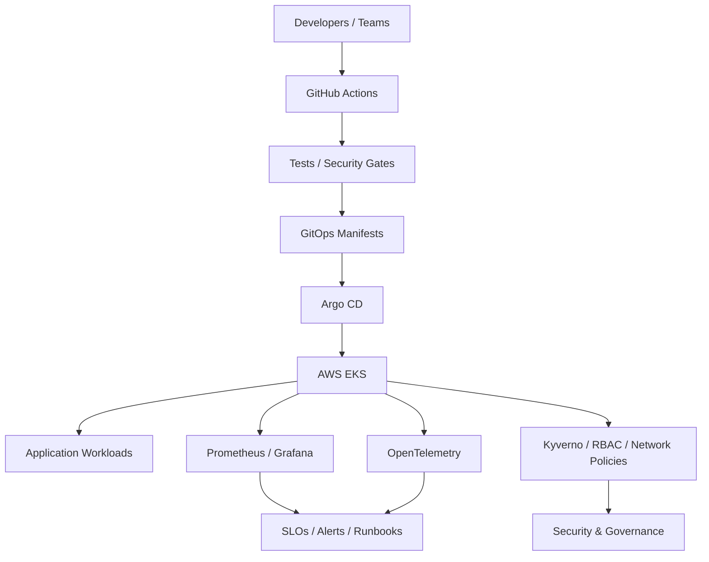

# Production Cloud Platform Engineering

<p align="center"><strong>A reference Internal Developer Platform on AWS EKS</strong></p>

<p align="center">
<a href="https://github.com/obinna-obika-devops/cloud-platform-engineering/actions/workflows/ci.yml"></a>


</p>

A production-style reference implementation of an internal developer platform on AWS EKS. The platform turns infrastructure and Kubernetes primitives into a safe self-service path for application teams while enforcing reliability, security, observability, and operational standards.

## Architecture



## Evidence at a glance

| Engineering area | Inspectable evidence |
|---|---|
| Cloud foundation | [`terraform/`](terraform/) |
| Kubernetes platform | [`platform/`](platform/) |
| Reusable application delivery | [`charts/`](charts/) + [`apps/`](apps/) |
| CI and security gates | [`.github/workflows/ci.yml`](.github/workflows/ci.yml) |
| Architecture and design | [`docs/architecture.md`](docs/architecture.md) |
| SRE and operations | [`docs/runbooks/`](docs/runbooks/) |
| Engineering decisions | [`docs/adr/`](docs/adr/) |
| Capability-to-code map | [`docs/engineering-evidence.md`](docs/engineering-evidence.md) |

## Engineering model

**Developers** submit an application definition → **GitHub Actions** validates and packages it → **Argo CD** reconciles desired state → **EKS** runs the workload → **Prometheus/Grafana/OpenTelemetry** provide telemetry → **SLOs, policies, quotas, RBAC and security controls** protect the platform.

## Demonstrated capabilities

- AWS VPC + EKS foundation with Terraform
- Reusable infrastructure modules and environment separation
- GitOps with Argo CD
- Kubernetes multi-tenancy: namespaces, RBAC, quotas, limits and network policies
- Self-service deployment workflow and Helm packaging
- HPA, PDB and topology-aware scheduling
- Prometheus/Grafana observability and OpenTelemetry instrumentation
- SLO/error-budget definitions and incident runbooks
- Kyverno policy-as-code; Trivy, Checkov and Gitleaks security gates
- Supply-chain controls and immutable image references
- Disaster recovery, platform operating model and cost guardrails

## Engineering documentation

- [Engineering Evidence](docs/engineering-evidence.md) — maps platform capabilities to inspectable artifacts
- [Architecture](docs/architecture.md) — system design and platform boundaries
- [Operational Runbook](docs/runbooks/operational-runbook.md) — operational procedures
- [Incident Response](docs/runbooks/incident-response.md) — incident handling workflow
- [Disaster Recovery](docs/runbooks/disaster-recovery.md) — recovery planning and validation
- [Platform Operating Model ADR](docs/adr/ADR-001-platform-operating-model.md) — engineering decision record
- [CI Workflow](.github/workflows/ci.yml) — automated infrastructure, application and security validation

## Technology

| Domain | Stack |
|---|---|
| Cloud | AWS, EKS, VPC |
| IaC | Terraform |
| Containers | Docker, Kubernetes, Helm |
| Delivery | GitHub Actions, Argo CD, GitOps |
| Observability | Prometheus, Grafana, OpenTelemetry |
| Security | Kyverno, Trivy, Checkov, Gitleaks |
| Reliability | SLOs, error budgets, PDB, HPA, DR |

## Repository map

```text
terraform/       AWS/EKS platform foundation
platform/        cluster-wide policies and GitOps bootstrap
charts/          reusable application Helm chart
apps/            example production-style service
.github/         CI and self-service workflows
docs/            architecture, SLOs, runbooks and ADRs
```

## Quick start

```bash
terraform -chdir=terraform fmt -check
terraform -chdir=terraform init
terraform -chdir=terraform validate
helm lint charts/platform-service
```

For an AWS deployment, provide credentials through CI identity federation or a local AWS profile and supply the required Terraform variables. Never commit credentials.

## Production engineering notes

The design emphasizes failure modes, reconciliation, blast-radius reduction, workload isolation, error budgets, least-privilege access, operational visibility and platform abstractions that reduce developer cognitive load.

## Scope

**Status:** portfolio/reference implementation. The repository contains no cloud credentials, private keys, or claims of currently running AWS resources unless explicitly provisioned by an operator.
