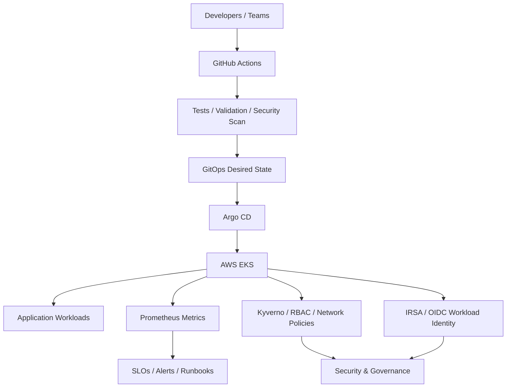

# Production Cloud Platform Engineering

<p align="center"><strong>A production-style Internal Developer Platform reference on AWS EKS</strong></p>

<p align="center">
<a href="https://github.com/obinna-obika-devops/cloud-platform-engineering/actions/workflows/ci.yml"></a>


</p>

## Why this platform exists

Engineering teams often lose time rebuilding the same cloud and Kubernetes foundations, handling access inconsistently, and relying on manual deployment steps that become difficult to audit or recover from.

This project models a platform engineering approach where infrastructure, application delivery, security controls, observability and operational standards are assembled into a repeatable self-service path. The goal is not simply to provision an EKS cluster; it is to demonstrate how a team can create safer defaults for developers while keeping infrastructure changes reviewable, observable and reversible.

## What I built

- Terraform-based AWS networking and EKS foundation
- Reusable environment configuration for development, staging and production patterns
- Kubernetes tenancy controls with namespaces, RBAC, quotas and default-deny networking
- GitOps reconciliation model using Argo CD boundaries and retry controls
- Reusable Helm-based application delivery path
- Workload identity using EKS OIDC and IRSA instead of long-lived application credentials
- Prometheus-ready application instrumentation with SLO and runbook documentation
- Policy-as-code controls with Kyverno
- CI validation for Terraform, Helm, Kubernetes manifests, application tests, container builds and Trivy security scanning
- Self-service workflow patterns with validation, concurrency protection and audit context
- Disaster-recovery, incident-response and operational documentation

## Architecture



## Engineering decisions

**GitOps over direct cluster changes.** Desired state stays versioned and reviewable, while Argo CD provides a clear reconciliation boundary between source control and the cluster.

**Short-lived workload identity over static credentials.** IRSA is used as the workload-access pattern so applications can receive narrowly scoped AWS permissions without embedding long-lived access keys.

**Policy and tenancy controls by default.** Namespaces, quotas, RBAC, network policies and restricted workload settings are treated as platform defaults rather than optional hardening steps.

**Validation before deployment.** CI checks Terraform formatting and validation, lints Helm, renders Kubernetes manifests, builds the application image, runs unit tests and blocks high/critical filesystem findings through Trivy.

**Reliability as part of platform design.** HPA, PDB, rolling updates, topology-aware scheduling, SLO definitions and operational runbooks are included so reliability is not left until after deployment.

## Evidence at a glance

| Engineering area | Inspectable evidence |
|---|---|
| Cloud foundation | [`terraform/`](terraform/) |
| Remote state & environments | [`docs/terraform-state-and-environments.md`](docs/terraform-state-and-environments.md) |
| Workload identity | [`terraform/modules/irsa/`](terraform/modules/irsa/) |
| Kubernetes platform | [`platform/`](platform/) |
| Reusable application delivery | [`charts/`](charts/) + [`apps/`](apps/) |
| Application observability | [`apps/platform-demo/app.py`](apps/platform-demo/app.py) |
| CI validation | [`.github/workflows/ci.yml`](.github/workflows/ci.yml) |
| Self-service workflow | [`.github/workflows/self-service.yml`](.github/workflows/self-service.yml) |
| Architecture and design | [`docs/architecture.md`](docs/architecture.md) |
| SRE and operations | [`docs/runbooks/`](docs/runbooks/) |
| Engineering decisions | [`docs/adr/`](docs/adr/) |
| Capability-to-code map | [`docs/engineering-evidence.md`](docs/engineering-evidence.md) |

## Engineering model

**Developers** submit changes → **GitHub Actions** validates infrastructure, application and security controls → **GitOps desired state** is reviewed → **Argo CD** reconciles the approved state → **EKS** runs the workload → **metrics, SLOs, policies, quotas, RBAC and network controls** make the platform observable and governable.

## Demonstrated capabilities

- AWS VPC + private-endpoint EKS foundation with Terraform
- KMS encryption for Kubernetes secrets and EKS control-plane logging
- Remote-state backend pattern with environment-specific state isolation
- Reusable Terraform modules and dev/staging/production configuration
- EKS OIDC provider plus reusable IRSA workload-identity module
- GitOps reconciliation with Argo CD project boundaries and retry controls
- Kubernetes multi-tenancy with namespaces, RBAC, quotas, limits and default-deny networking
- Restricted Pod Security admission and hardened workload security contexts
- Self-service environment requests with validation, concurrency protection and audit context
- HPA, PDB, rolling updates and topology-aware scheduling
- Prometheus application metrics and scrape discovery
- SLO/error-budget definitions and incident runbooks
- Kyverno policy-as-code controls
- Docker image build, application tests, Terraform/Helm validation and Trivy scanning in CI
- Disaster-recovery and platform operating procedures

## Engineering documentation

- [Engineering Evidence](docs/engineering-evidence.md) — maps platform capabilities to inspectable artifacts
- [Architecture](docs/architecture.md) — system design and platform boundaries
- [Terraform State & Environments](docs/terraform-state-and-environments.md) — remote-state and environment strategy
- [Workload Identity & Observability](docs/workload-identity-and-observability.md) — IRSA and metrics design
- [Operational Runbook](docs/operational-runbook.md) — operational procedures
- [Incident Response](docs/incident-response.md) — incident handling workflow
- [Disaster Recovery](docs/disaster-recovery.md) — recovery planning and validation
- [Platform Operating Model ADR](docs/adr-001-platform-operating-model.md) — engineering decision record
- [CI Workflow](.github/workflows/ci.yml) — automated infrastructure, application and security validation

## Technology

| Domain | Stack |
|---|---|
| Cloud | AWS, EKS, VPC |
| IaC | Terraform, S3 remote-state pattern |
| Identity | IAM, EKS OIDC, IRSA |
| Containers | Docker, Kubernetes, Helm |
| Delivery | GitHub Actions, Argo CD, GitOps |
| Observability | Prometheus instrumentation and scrape discovery |
| Security | Kyverno, RBAC, NetworkPolicy, Pod Security, Trivy |
| Reliability | SLOs, error budgets, PDB, HPA, topology spread, DR |

## Repository map

```text
terraform/       AWS/EKS foundation, environment values and IRSA module
platform/        cluster policies, tenancy controls and GitOps definitions
charts/          reusable application Helm chart
apps/            instrumented example service and tests
.github/         CI and self-service workflows
docs/            architecture, SLOs, runbooks, state strategy and ADRs
```

## Local validation

```bash
terraform -chdir=terraform fmt -check -recursive
terraform -chdir=terraform init -backend=false
terraform -chdir=terraform validate
helm lint charts/platform-service
python -m pip install -r apps/platform-demo/requirements.txt
python -m unittest discover -s apps/platform-demo/tests -p "test_*.py"
```

For an AWS deployment, initialize Terraform with an environment-specific backend configuration and use short-lived AWS credentials. Never commit credentials or backend secrets.

## Scope

This repository is a reference implementation and engineering portfolio project. It intentionally contains no cloud credentials and does not claim currently running AWS infrastructure, a connected Prometheus installation, or production traffic unless those components are explicitly deployed by an operator.
