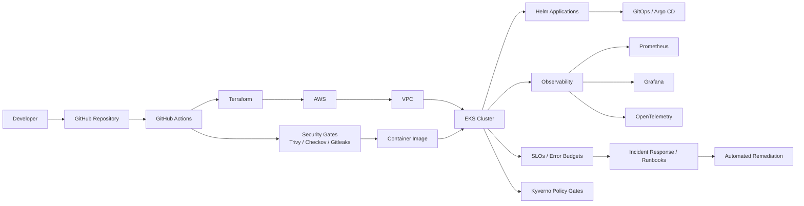
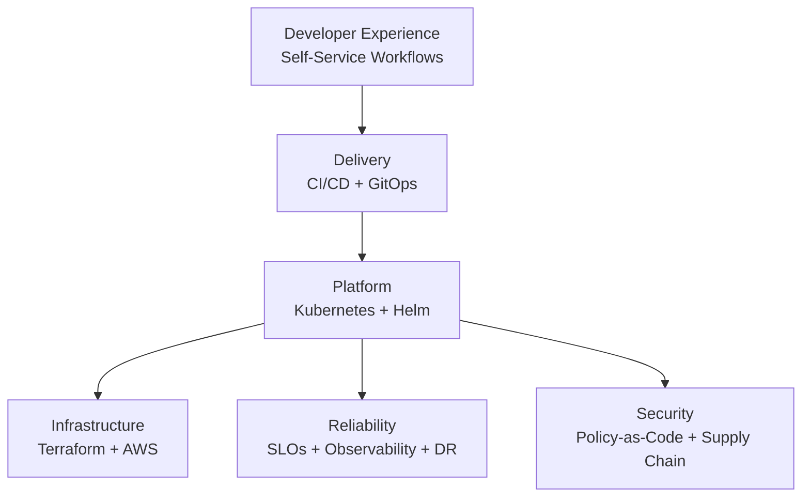

# Platform Architecture

## End-to-End Platform Flow

## Engineering Layers

## Change Lifecycle

1. Developer proposes a change through Git.
2. CI validates code, infrastructure, and security controls.
3. Terraform manages infrastructure changes as code.
4. GitOps reconciles application configuration.
5. Kubernetes runs workloads with platform guardrails.
6. Observability measures service health and reliability objectives.
7. SRE controls guide incident response, remediation, and recovery.

> Portfolio/reference architecture. This diagram describes the engineering design represented by the repository and does not imply a live production deployment.