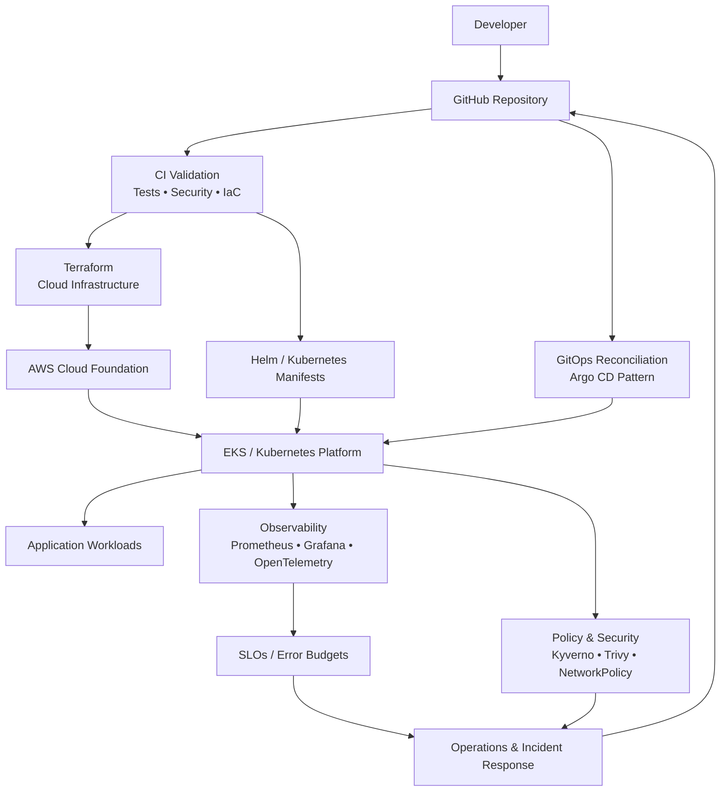

# Platform Architecture

This diagram shows the intended architecture and engineering boundaries of the cloud platform reference implementation.

## Engineering flow

**Developer change → Git → CI validation → infrastructure/application reconciliation → Kubernetes workload → observability/security controls → operational feedback**

## Design principles

- Infrastructure is defined as code and validated before change promotion.
- Git is the source of truth for declarative platform configuration.
- Kubernetes workloads are protected with resource, access, network, and policy controls.
- Observability is tied to measurable reliability objectives.
- Security controls are integrated into the delivery lifecycle rather than treated as a separate stage.
- Operational feedback feeds the next engineering change.

> Portfolio/reference architecture. The diagram describes the engineering design represented by this repository; it does not claim a production deployment.